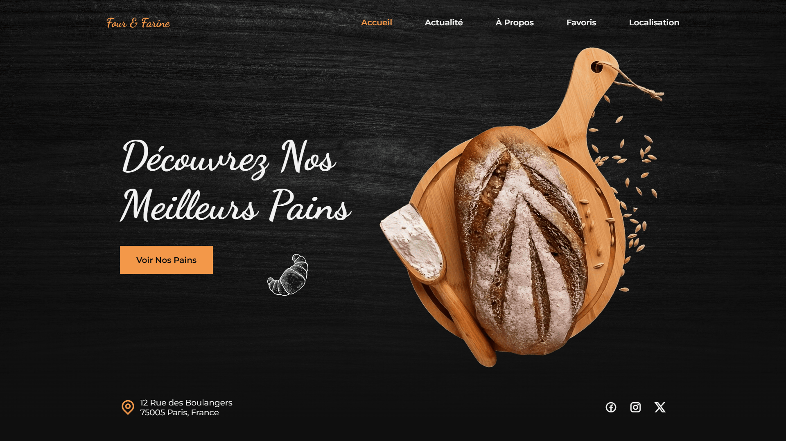

<div align="center">  
    <a href="https://bakery-paris.netlify.app/" target="_blank">  
        
    </a>
    </br>  
    </br>  
  <h3 align="center">🥖 Four & Farine &nbsp; — &nbsp; Boulangerie Artisanale</h3>  
</div>

## <br /> 📌 Sommaire

&nbsp;&nbsp;&nbsp; 🎨 &nbsp; [**Introduction**](#introduction)<br />
&nbsp;&nbsp;&nbsp; 🛠️ &nbsp; [**Technologies**](#technologies)<br />
&nbsp;&nbsp;&nbsp; 🎯 &nbsp; [**Fonctionnalités**](#fonctionnalités)<br />
&nbsp;&nbsp;&nbsp; 🚀 &nbsp; [**Installation**](#installation)<br />

## <br /> <a name="introduction">🎨 Introduction</a>

Four & Farine est une landing page moderne et minimaliste pour une boulangerie artisanale, développée en HTML, CSS et JavaScript. Elle met en valeur les spécialités maison, les nouveautés, les produits favoris et l’adresse du commerce, avec animations fluides via ScrollReveal.js et design chaleureux. Parfaite pour tout artisan souhaitant valoriser ses créations dans le secteur culinaire.

## <br /> <a name="technologies">🛠️ Technologies</a>

- HTML5 sémantique et structuration claire
- CSS3 moderne avec variables, media queries et animations
- JavaScript ES6 clair et modulaire
- [ScrollReveal](https://scrollrevealjs.org/) pour des animations au scroll
- [Remix Icons](https://remixicon.com/) pour des icônes vectorielles modernes
- Responsive Design pensé en mobile-first

## <br /> <a name="fonctionnalités">🎯 Fonctionnalités</a>

- Landing page immersive avec image de fond
- Menu de navigation responsive avec ouverture et fermeture mobile
- Sections dynamiques : Accueil, Nouveautés, À propos, Favoris, Visite
- Présentation des pains avec titres, descriptions et prix en euros
- Footer complet avec adresse, horaires, contact et réseaux sociaux
- Animation de scroll fluide sur chaque section
- Affichage des liens actifs lors du scroll
- Scroll up button visible après défilement
- Design chaleureux adapté aux métiers de bouche
- Intégration Google Maps pour géolocalisation directe

## <br /> <a name="installation">🚀 Installation</a>

### ✅ Prérequis

- [Google Chrome](https://www.google.com/) &nbsp;—&nbsp; Navigateur moderne
- [Visual Studio Code](https://code.visualstudio.com/) &nbsp;—&nbsp; Éditeur de code
- [Live Server](https://marketplace.visualstudio.com/items?itemName=ritwickdey.LiveServer) &nbsp;—&nbsp; Extension VS Code

### 📥 Cloner le projet

```bash
git clone git@github.com:ValentinMadiot/bakery_ui
cd bakery_ui
```

### ▶️ Lancer le projet

Il suffit d’ouvrir le fichier `index.html` dans un navigateur, ou d’utiliser l’extension **Live Server** sur VS Code pour un aperçu dynamique.
